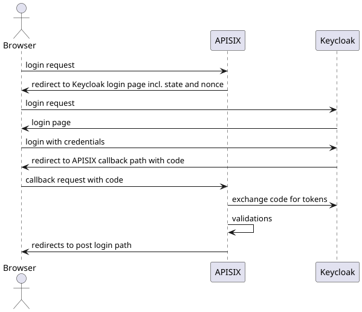
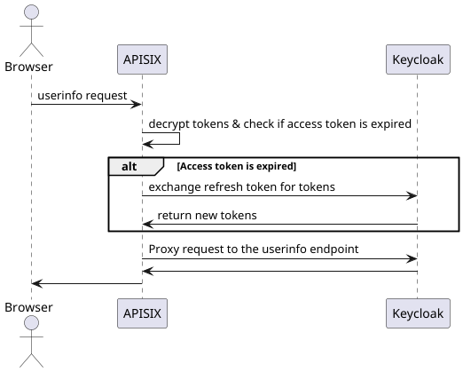
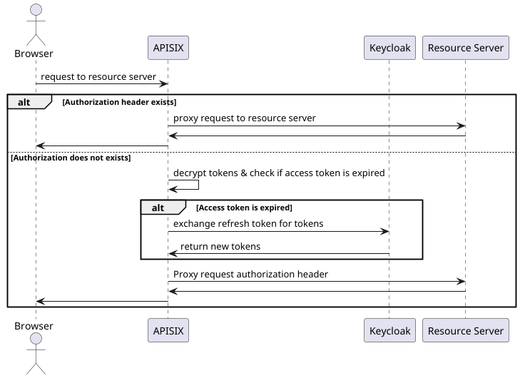
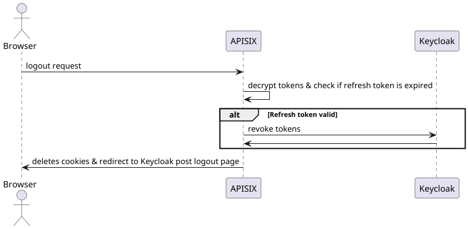

# OIDC Plugin

This plugin is designed to implement the token handler pattern. \
It must either run in the "ext-plugin-pre-request" or "ext-plugin-post-request" phase.

## Behaviour

The plugin will manage the access and the refresh token, automatically renew these tokens and put the access token in the Authorization header. \
For requests, which already have an Authorization header, the plugin will not touch the request. \
The plugin itself is stateless and can be run as multiple instances, as long as they share the same configuration. \
The tokens are stored as encrypted cookies in the browser, which will be filtered out before proxied to the upstream service.

The plugin will use a confidential client with pkce and nonce to authenticate the user.
Both the signature of the retrieved tokens and the audience in the access token will not be verified, that is the responsibility of the resource server.

If you are currently logged in and start another login process, the plugin will delete the cookies, but won't trigger a logout to the idp with the active session.

Furthermore, the plugin reserves some configurable endpoints to handle the authentication process, which will be intercepted by the plugin and not proxied to the upstream service:

- login path, starts the login process
- callback path, a step in the login process to receive the authorization code
- userinfo path, get the userinfo from the idp
- logout path, starts the logout process

Besides that, there are two paths configurable, to redirect the user after completing a login or logout process.

- post login path
- post logout path

## Configuration
The plugin expects a configuration passed as yaml like [this](../../.docker-compose/apisix.yaml). \
All configuration options and their explanations can be found  [here](configuration.yaml).

## Flows

These flows only showcase the happy paths, error handling is not shown. \
When there is an authentication error, the plugin will return a 401 status code.
If the plugin is not configured properly, it will return a 500 status code.

### Login

### Userinfo

### Proxy

### Logout
